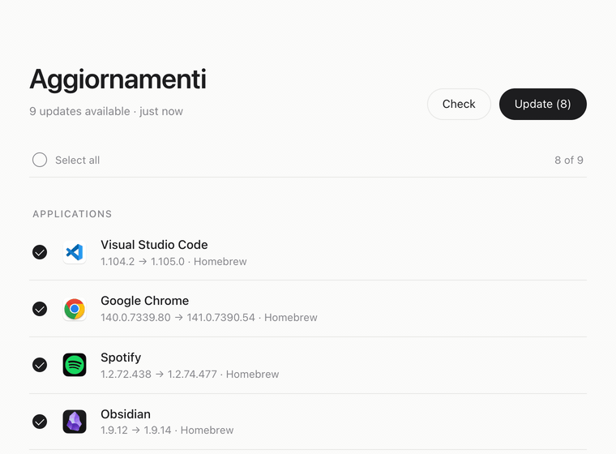
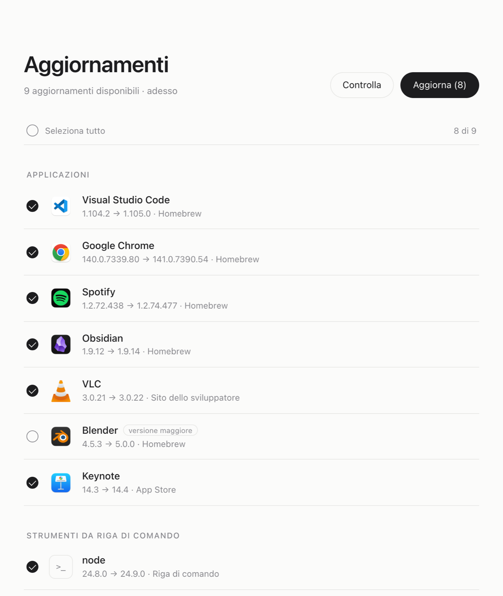
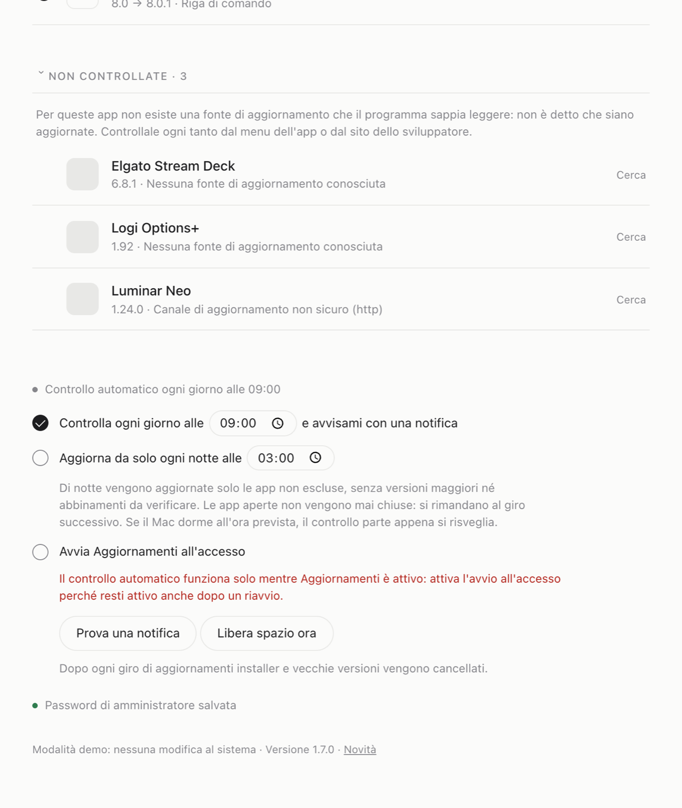

# Aggiornamenti

**Una pagina web locale e sobria che trova tutte le app del Mac da aggiornare e le aggiorna in silenzio.** Scegli quali aggiornare o aggiornale tutte con un clic. Niente finestre, niente conferme, niente account.

[English README →](README.md)



## Cosa fa

- **Un solo elenco per tutto:** app Homebrew, app installate a mano, Mac App Store, app con aggiornamento Sparkle e strumenti da riga di comando.
- **Aggiornamenti silenziosi:** le app aperte vengono chiuse, aggiornate e riaperte in background.
- **Avanzamento reale:** ogni pacchetto mostra la fase (download, installazione, sostituzione, rifinitura) con la percentuale vera del download.
- **Esclusioni:** le app che vuoi tenere a una versione precisa finiscono in una sezione separata, da cui puoi comunque aggiornarle a mano.
- **Modalità automatica:** controllo giornaliero con notifica cliccabile, oppure aggiornamento notturno che non chiude mai un'app che stai usando.
- **Onesto sui punti ciechi:** la sezione "Non controllate" elenca le app che nessuna fonte sa verificare, con il motivo.
- **Nessun avanzo su disco:** installer e vecchie versioni vengono cancellati dopo ogni giro. Sul Mac dell'autore la prima pulizia ha liberato 6,4 GB.
- **Si aggiorna da solo:** quando esce una nuova versione di Aggiornamenti la pagina la segnala con un pulsante *Installa*, e il controllo giornaliero manda una notifica.
- **Italiano e inglese** secondo la lingua del Mac, tema chiaro e scuro.

| | |
|---|---|
|  |  |

## Installazione

Serve [Homebrew](https://brew.sh). Poi:

```bash
brew install giuseppelupo1979/tap/aggiornamenti
```

Homebrew 7 chiede di dare fiducia una volta ai tap di terze parti. Se segnala che il tap non è fidato:

```bash
brew trust --formula giuseppelupo1979/tap/aggiornamenti
```

e ripeti l'installazione. Vengono installati anche `mas` (App Store) e `terminal-notifier` (notifiche cliccabili).

Per aprirlo:

```bash
aggiornamenti
```

Per avere l'app sulla Scrivania:

```bash
aggiornamenti app
```

<details>
<summary>Installazione manuale, senza tap</summary>

```bash
git clone https://github.com/giuseppelupo1979/aggiornamenti-mac.git ~/aggiornamenti-mac
~/aggiornamenti-mac/installa.sh
```

</details>

## Provarlo senza toccare nulla

```bash
aggiornamenti demo
```

La modalità demo mostra app di esempio e simula gli aggiornamenti su una porta separata, senza modificare nulla sul sistema.

## Comandi

| Comando | Cosa fa |
|---|---|
| `aggiornamenti` | avvia il server se serve e apre http://127.0.0.1:8765 |
| `aggiornamenti start` / `stop` | avvia o ferma il server senza aprire la pagina |
| `aggiornamenti demo` | modalità demo con dati di esempio |
| `aggiornamenti app` | crea l'app Aggiornamenti sulla Scrivania |
| `aggiornamenti version` | mostra la versione |

Per usare una porta diversa dalla 8765 imposta `AGG_PORT` (per esempio `AGG_PORT=9000 aggiornamenti`).

Il manuale d'uso completo è in [MANUALE.md](MANUALE.md), le novità di ogni versione in [CHANGELOG.md](CHANGELOG.md).

## Privacy e sicurezza

- **Dal Mac escono solo le richieste necessarie** a controllare e scaricare gli aggiornamenti: catalogo Homebrew, canali di aggiornamento delle app installate, server di download degli sviluppatori e, al massimo ogni sei ore, l'API pubblica di GitHub per sapere se esiste una nuova versione di Aggiornamenti. Niente telemetria, niente account. La ricerca web si apre solo se premi tu *Cerca*.
- **Il server ascolta solo su `127.0.0.1`** e rifiuta richieste da altri siti, compresi i tentativi di DNS rebinding.
- **La password di amministratore è facoltativa e sta solo nel Portachiavi** (voce `aggiornamenti-mac`). Viene verificata prima di essere salvata, non viene mai scritta su disco né compare nei processi, e si rimuove dalla pagina in qualsiasi momento.
- **Le app installate a mano passano sotto Homebrew** al primo aggiornamento fatto da qui (`brew install --cask --force` sostituisce la copia esistente). Se non lo vuoi, escludile.
- **I download Sparkle sono verificati:** app e `.pkg` si installano solo se la firma è valida e appartiene allo stesso sviluppatore (Team ID) della versione installata.
- **L'aggiornamento notturno è prudente:** salta app escluse, versioni maggiori e abbinamenti da verificare, e non chiude mai le app aperte.

## Limiti

- Gli aggiornamenti di macOS vengono solo segnalati, con un pulsante che apre Aggiornamento Software.
- Le app con sistemi di aggiornamento propri (Microsoft AutoUpdate, Adobe) sono coperte solo se presenti nel catalogo Homebrew.
- Il confronto delle versioni è numerico: numerazioni insolite possono generare qualche falso aggiornamento, che basta deselezionare o escludere.

## Disinstallazione

```bash
aggiornamenti stop
launchctl bootout gui/$(id -u)/com.aggiornamenti-mac 2>/dev/null
rm -f ~/Library/LaunchAgents/com.aggiornamenti-mac.plist
security delete-generic-password -s aggiornamenti-mac 2>/dev/null
rm -rf ~/Library/Caches/AggiornamentiMac "$HOME/Library/Application Support/AggiornamentiMac" ~/Desktop/Aggiornamenti.app
brew uninstall aggiornamenti
```

## Licenza

Distribuito con [licenza MIT](LICENSE): libero da usare, modificare e condividere. Il software è fornito **senza alcuna garanzia**. Installa e sostituisce programmi sul Mac, quindi lo usi a tuo rischio e conviene avere un backup, come con qualsiasi strumento di sistema.

Realizzato da Giuseppe Lupo con Claude (Anthropic).
