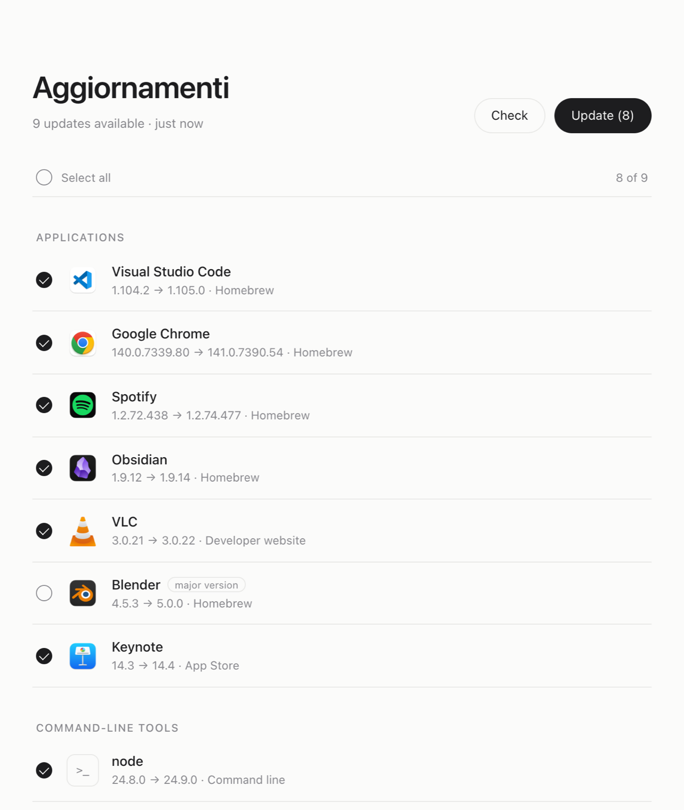
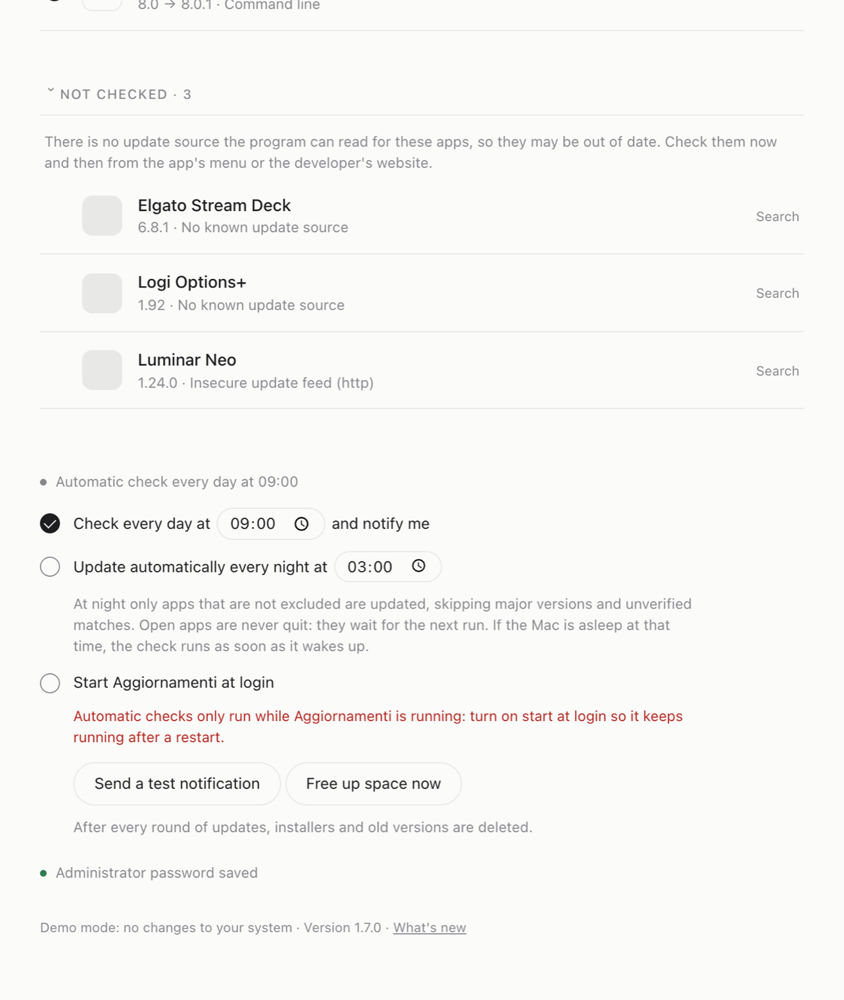
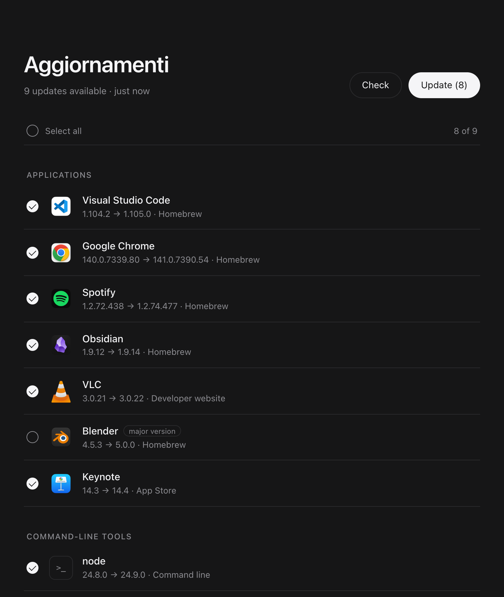

# Aggiornamenti

**A quiet, local web page that finds every outdated app on your Mac and updates it silently.** Pick what to update, or update everything with one click. No windows, no prompts, no account.

*Aggiornamenti* is Italian for "updates". [Leggimi in italiano →](LEGGIMI.md)


## Why

Keeping a Mac up to date means juggling Homebrew, the App Store and dozens of apps with their own updaters. Aggiornamenti puts all of them on one page:

- **One list for everything.** Homebrew apps, apps you installed by hand, Mac App Store apps, apps with a Sparkle updater and command-line tools.
- **Silent updates.** Open apps are quit, updated and reopened in the background.
- **Real progress.** Every package shows its phase (downloading, installing, replacing the old version, finishing), with real download percentages.
- **Exclusions.** Hide the apps you want to keep at a specific version. They move to a separate section, from which you can still update them by hand.
- **Automatic mode.** A daily check with a clickable notification, or fully automatic nightly updates that never quit an app you are using.
- **Honest about blind spots.** A "Not checked" section lists the apps no source can verify, with the reason for each.
- **No leftovers.** Installers and old versions are deleted after every round of updates. The first cleanup on the author's Mac freed 6.4 GB.
- **English and Italian**, following your Mac's language. Light and dark mode.

| | |
|---|---|
|  |  |
|  |  |

## Install

You need [Homebrew](https://brew.sh). Then:

```bash
brew install giuseppelupo1979/tap/aggiornamenti
```

Homebrew 7 asks you to trust third-party taps once. If it tells you the tap is not trusted, run:

```bash
brew trust --formula giuseppelupo1979/tap/aggiornamenti
```

and install again. This also installs [`mas`](https://github.com/mas-cli/mas) (for the App Store) and [`terminal-notifier`](https://github.com/julienXX/terminal-notifier) (for clickable notifications).

Open it:

```bash
aggiornamenti
```

Optionally, put an app on your Desktop that does the same with a double click:

```bash
aggiornamenti app
```

<details>
<summary>Manual install, without the tap</summary>

```bash
git clone https://github.com/giuseppelupo1979/aggiornamenti-mac.git ~/aggiornamenti-mac
~/aggiornamenti-mac/installa.sh
```

</details>

## Try it without touching anything

```bash
aggiornamenti demo
```

Demo mode shows sample apps and simulates updates on a separate port. It changes nothing on your system, so it is a safe way to look around before trusting the tool with your Mac.

## Usage

| Command | What it does |
|---|---|
| `aggiornamenti` | starts the local server if needed and opens http://127.0.0.1:8765 |
| `aggiornamenti start` / `stop` | starts or stops the server without opening the page |
| `aggiornamenti demo` | demo mode with sample data |
| `aggiornamenti app` | creates the Aggiornamenti app on the Desktop |
| `aggiornamenti version` | prints the version |

In the page:

- **Click a row** to select it, or use **Select all**, then press **Update**. Apps flagged *major version* or *unverified* are never preselected.
- **Hover a row** and click **Exclude** to move an app to the *Excluded* section.
- **Automatic check** (at the bottom): daily check time, nightly updates and *start at login*. Turn on *start at login*, because the schedule only runs while the server is running.
- **Administrator password** (optional): App Store updates and `.pkg` installers need admin rights. Without the password, everything else still works.

The full manual is in Italian: [MANUALE.md](MANUALE.md).

## How it works

| Source | How updates are found | How they are installed |
|---|---|---|
| Apps installed with Homebrew | `brew outdated --greedy` | `brew upgrade --cask` |
| Apps installed by hand | matched against the [Homebrew catalog](https://formulae.brew.sh) by app name or bundle ID | `brew install --cask --force` |
| Mac App Store | `mas outdated` | `mas update` |
| Apps with a Sparkle feed, not in the catalog | the developer's update feed | download, signature check, replace |
| Command-line tools | `brew outdated` | `brew upgrade --formula` |

It is a single Python file using only the standard library, plus one HTML page. It runs on macOS's own Python 3.9 or newer.

## Privacy and safety: read this before installing

This tool replaces apps and can run installers as administrator, so here is exactly what it does:

- **Nothing leaves your Mac except the requests needed to check and download updates.** These go to the Homebrew catalog, the update feeds of your installed apps and the developers' download servers. There is no telemetry, no account and no analytics. A web search is opened only when you click *Search* yourself.
- **The server listens only on `127.0.0.1`** and rejects requests that come from other websites.
- **The administrator password is optional and lives only in your macOS Keychain** (item `aggiornamenti-mac`). It is checked before being saved, it is never written to disk or shown in the process list, and `askpass.sh` hands it to `sudo` only when an update needs it. You can remove it from the page at any time.
- **Apps you installed by hand become managed by Homebrew** after their first update through this tool (`brew install --cask --force` replaces the existing copy). From then on Homebrew keeps them up to date. If you would rather not, exclude those apps.
- **Sparkle downloads are verified.** An app or `.pkg` is installed only if its code signature is valid and comes from the same developer (Team ID) as the version already installed.
- **Nightly updates are conservative.** Only apps that are not excluded are updated, major versions and unverified matches are skipped, and open apps are never quit.

## Limitations

- macOS system updates are only reported, with a button that opens Software Update. They are not installed.
- Apps with their own update systems (Microsoft AutoUpdate, Adobe) are covered only if they are in the Homebrew catalog.
- Versions are compared numerically. Unusual numbering can produce the occasional false update, which you can simply deselect or exclude.

## Uninstall

```bash
aggiornamenti stop
launchctl bootout gui/$(id -u)/com.aggiornamenti-mac 2>/dev/null
rm -f ~/Library/LaunchAgents/com.aggiornamenti-mac.plist
security delete-generic-password -s aggiornamenti-mac 2>/dev/null
rm -rf ~/Library/Caches/AggiornamentiMac "$HOME/Library/Application Support/AggiornamentiMac" ~/Desktop/Aggiornamenti.app
brew uninstall aggiornamenti
```

## Changelog and license

What changed in each version: [CHANGELOG.md](CHANGELOG.md).

Released under the [MIT License](LICENSE): free to use, modify and share. The software comes with **no warranty**. It installs and replaces software on your Mac, so you use it at your own risk and should keep backups, as you would with any system tool.

Made by Giuseppe Lupo with Claude (Anthropic).
